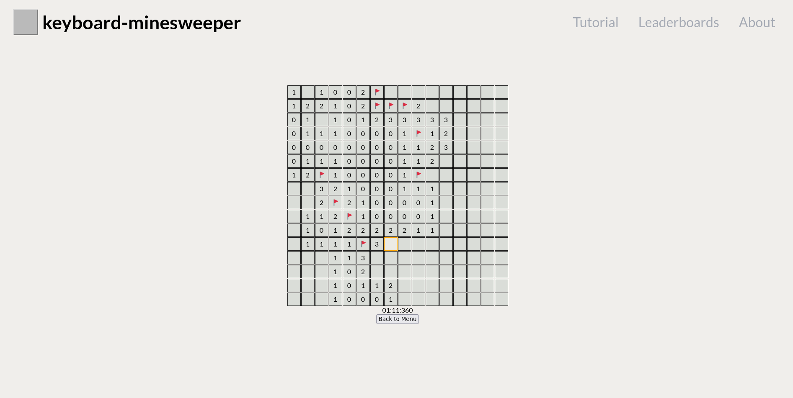

# kb-minesweeper-frontend

This repository contains a Minesweeper clone created using Vue JS and TypeScript. The game can be played using your keyboard exclusively. **NB! This project is a work in progress.**



## Project Setup

```sh
npm install
```

### Compile and Hot-Reload for Development

```sh
npm run dev
```

### Type-Check, Compile and Minify for Production

```sh
npm run build
```
